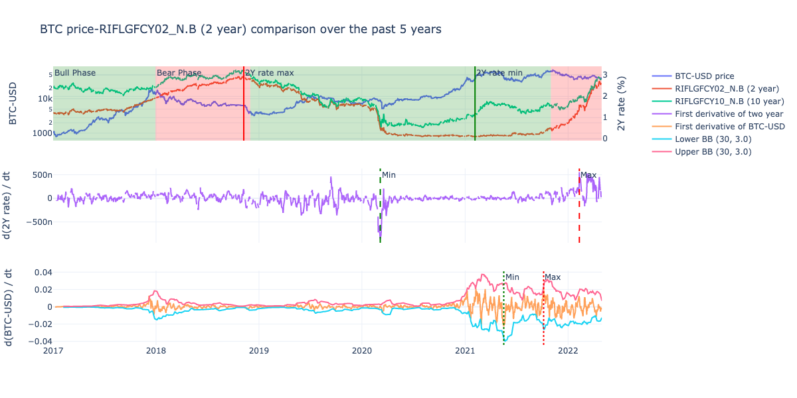
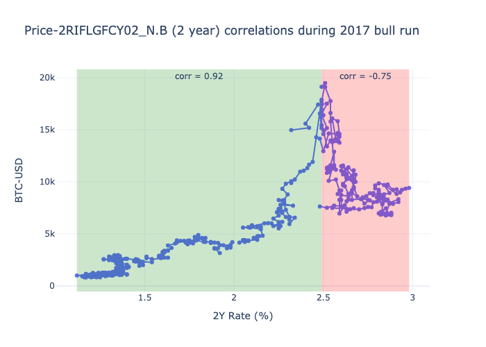

# Market Analytics

Mathematical analysis of orderbook data, bitcoin market cycles and crypto project valuations.

## Orderbook Delta
A trading bot for this strategy is written in Rust [here](https://github.com/dineshpinto/orderbook-delta-bot).

The idea behind this is the concept of _mean reversion_. We look for large deviations in the volume delta of BTC-PERP 
on FTX at depth=1.  These deviations could be caused by over-enthusiastic and over-leveraged market participants.

We counter-trade those deviations, and enter short/long positions based on triggers given by a large delta (> 2 SDs) 
from a (10-20) period rolling bollinger band.

The full analysis is in [notebooks/OrderbookDeltaAnalyzer.ipynb](notebooks/OrderbookDeltaAnalyzer.ipynb)

Interactive image [here](images/orderbook_delta_analyzer.html) (may need to be downloaded as GitHub limits hosted file size)


### Limitations
1. The data is almost certainly over-fit, there's even a TODO to test for it ;)
2. Needs to tested on significantly more data

### TODO
1. Extract probabilities to use as inputs for Kelly criterion
2. Use multiple statical models to predict market moves (in progress)
3. Perform spectral analysis for market timing

## Crypto and its correlation to interest rates





## Open interest and funding rates
We use a metric derived from the product of the open interest, future dilution and funding rate, normalized by the market cap. 
The metrics name is FOM, derived from **F**unding rate, **O**pen Interest and **M**arket cap. 
The FOM metric indicates whether futures market participants hold a strong bias, generally for smaller cap projects 
trading on popular derivatives exchanges. 
The direction of the bias is indicated by the funding rate. The variation of the FOM with different projects is shown 
in this image below.

The top 5 percentile of projects with the highest FOM (on 2022-04-23) are shown in the table below.
The higher the FOM, the larger the relative position futures participants have taken.

| Token | FOM  | Direction | 
|-------|------|-----------|
| LOOKS | 7.6μ | Short     | 
| GMT   | 2.1μ | Short     | 
| CRV   | 1.9μ | Short     |
| SRM   | 0.9μ | Short     |
| RAY   | 0.7μ | Short     |
| BIT   | 0.6μ | Short     |

The full analysis is in [notebooks/FuturesOpenInterestAnalyzer.ipynb](notebooks/FuturesOpenInterestAnalyzer.ipynb)


### Limitations:
1. While this does give the prevailing sentiment among the futures market participants,
it does not provide any information about timeframes or price levels. 
2. Building on point 1, the main limitation is the lack of historical data. Tracking the buildup of shorts/longs over time is important,
both from the perspective of fitting it to some model and the price levels at which they enter.
3. In very certain cases, the market participants may simply be hedging their positions due to some upcoming event, 
perhaps this could be filtered out by a simple social media volume tracker...


## Bitcoin Market Analysis

Understanding market cycles using basic mathematics is a fun exercise. Here we use simple geometric progressions on the length of Bitcoin bull and bear 
cycles to estimate the length of future cycles. This simple model is able to accurately predict a 26 month bull cycle peaking in April 2021, followed 
by a 3 month bear cycle. It further predicts 10 month bull cycle ending in **July 2022**, after which the model starts predicting a bear cycle length tending to 0.

We speculate that the bear cycle length is likely due to the failure of the model. 
However, if this is not the case, then possibly a large event has led to hyperbitcoinization, leading to only bull cycles. 
Given the nature of the geometric progression however, this will not last forever, and the bull cycle length will also tend to 0 with time.

The full analysis is in [notebooks/BitcoinGeometricProgression.ipynb](notebooks/BitcoinGeometricProgression.ipynb)


## Project Valuation
Finding undervalued projects based on metrics such as fully diluted valuation, current valuation and percent since ATH.

The full analysis is in [notebooks/ProjectValuation.ipynb](notebooks/ProjectValuation.ipynb)


## Installation
1. Create the conda environment from file (for Mac M1)
```shell
conda env create --file conda-env.yml
```
3. Activate environment 
```shell
conda activate market_analytics
```
4. Add environment to Jupyter kernel 
```shell
python -m ipykernel install --name=market_analytics
```
5. Install jupyter lab extensions for plotly 
```shell
jupyter labextension install jupyterlab-plotly
```
6. Explore the various Jupyterlab Notebooks under `notebooks/`
```shell
jupyter lab
```


### Export conda environment
```shell
conda env export --no-builds | grep -v "^prefix: " > conda-env.yml
```

## Disclaimer
This project is only for educational purposes. There is no guarantee of the accuracy of the output data. Do not make any trading or investment decisions based on these results. Always do your own research.
